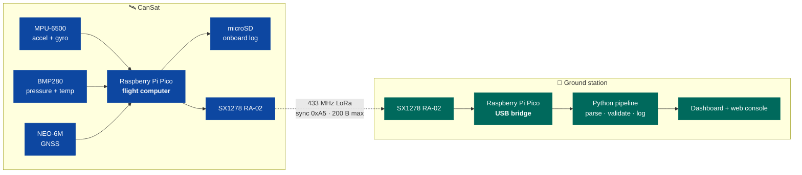
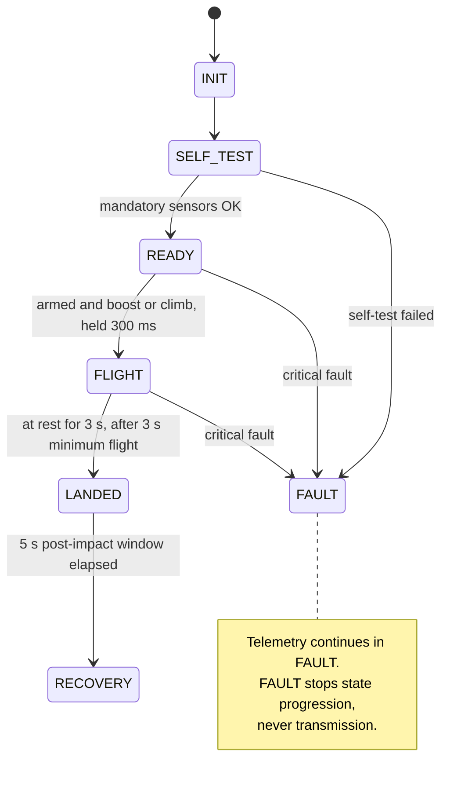
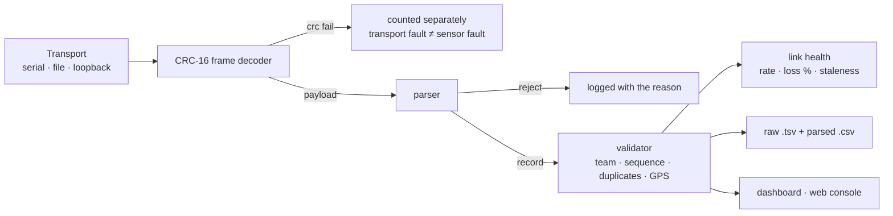

<div align="center">

# CanSat 2026

**A can-sized satellite that is carried to launch altitude, deploys a parachute, carries an egg
chamber, and streams telemetry from power-on through recovery.**

**Submitted 2026-09-14 · flown 2026-09-30 · two descents, 102 distinct packets received**

Repository: <https://github.com/KunjSorathiya/CanSat-Team-Singularity> · Team Singularity · `CAN-Team-25` · SVNIT Physics Club CanSat Competition 2026

[](https://github.com/KunjSorathiya/CanSat-Team-Singularity/actions/workflows/ci.yml)
[](documentation/testing/test-plan.md)
[](documentation/testing/test-plan.md)
[](firmware/)
[](ground-station/)
[](documentation/design/telemetry-protocol.md)
[](analysis/flight-2026-09-30/)
[](documentation/testing/bring-up-record.md)
[](mechanical/README.md)

[**Final report (PDF)**](documentation/project/CanSat-2026-Final-Project-Report.pdf) ·
[**Flight analysis**](analysis/flight-2026-09-30/) ·
[Mission profile](documentation/mission/concept-of-operations.md) ·
[Architecture](documentation/design/software-architecture.md) ·
[Wiring](documentation/design/wiring.md) ·
[Timeline](documentation/project/timeline.md) ·
[Test plan](documentation/testing/test-plan.md) ·
[Runbook](documentation/operations/runbook.md) ·
[All docs](documentation/README.md)

</div>

---

## Where the project stands

| Layer | State |
|---|---|
| 🟢 **Flight** | **The vehicle flew on 2026-09-30** — two descents at the competition launch, recorded by the organizers' ground station. Steady descent **2.27 ± 0.05 m/s** and **1.88 ± 0.02 m/s** under the 6 ft canopy, from 29.5 m. See [Flight results](#flight-results) and the [analysis](analysis/flight-2026-09-30/) |
| 🟢 **Submission** | The CanSat and the first final report were submitted on 2026-09-14 (reported by the team). The report written **after** the flight, with the results, is [`CanSat-2026-Final-Project-Report.pdf`](documentation/project/CanSat-2026-Final-Project-Report.pdf) |
| 🟢 **Software** | Flight core, telemetry protocol, ground station and web console **implemented and passing 5825 automated checks on the host** (6,132 counting the 307 documented-claim checks), **and flown** — the flight image ran through two descents. Includes an end-to-end trace from the flight controller through the ground pipeline |
| 🟢 **Firmware drivers** | **Every driver has run on real silicon** and its numbers are recorded — IMU, barometer, GPS, radio and microSD. **The flight image itself runs**: it was flashed, it printed its startup summary, it wrote a card, and it produced [F-16](documentation/testing/bring-up-record.md#findings) and [F-19](documentation/testing/bring-up-record.md#findings), which are defects only a running image could have found |
| 🟢 **Hardware** | **The vehicle board is built and every device on it works** — **34 of 94 recorded measurements taken.** **The radio link closed end to end on 2026-09-07** — 66 packets, `P-001` to `P-066`, no gaps, no duplicates, 1.0000 Hz, −44 dBm at bench range, so Gate 8 has a bench link. Gates 3, 4, 5, 6 and 7 all pass on the soldered board — the IMU and barometer share I2C0 (`0x68` and `0x76`, `0x0C` correctly absent), the GPS emits clean NMEA at 162 B/s, the radio sends 5/5, 5/5 and 45/45 with airtimes within 1.8 % of the model, the card writes 100/100 and sustains ~300 writes/s, and the shared SPI0 bus passes every row. **Power is answered:** the Pico's own 3.3 V rail held **3.28–3.29 V through 45 back-to-back transmits** and 3.28–3.30 V at 100 % write duty, so no separate rail is needed. Sensor read costs 0.833 ms worst against a 33 ms period. **Open:** [F-12](documentation/testing/bring-up-record.md#findings), a card intermittent that failed three of its first four runs and has passed twelve since with the supply measured innocent; and [F-17](documentation/testing/bring-up-record.md#findings), **yaw measured drifting more than a full revolution in a 36.8-minute stationary log** — and, more usefully, holding to ±0.8° for the first 15 minutes before switching to 0.4 dps, which is **70° over a 3-minute flight** on a vehicle with no magnetometer; and [F-18](documentation/testing/bring-up-record.md#findings), a stationary GPS jumping 55.6 m in one second because nothing gates a fix on satellite count or HDOP. **Fitted before submission:** a rocker ON/OFF switch on short leads outside the frame, and the power LED (reported by the team, 2026-09-14), and the battery divider (33 kΩ / 33 kΩ, ratio 2.0, never measured). **Not fitted: the Schottky diode** — so USB and the battery must never be connected together. The microphone reaches the air as `SN-`. **Flown 2026-09-30:** the board ran two flights, the link held at **−109…−79 dBm** (margin ≥ 14 dB over the −123 dBm SF7 sensitivity), and after Flight 1 it restarted itself through the 2 s watchdog, recalibrated and kept transmitting |
| 🟢 **Mechanical** | **Built and in the mass band.** `Cansat_D1` was printed in **white PETG** and assembled on 2026-09-12 — electronics mounted, egg chamber fitted, **280 g without a parachute** on the scale. Before submission a **6 ft (1.83 m) canopy was sewn and fitted** — the 80 cm figure in the earlier documents is the model's guaranteed *minimum*, not what flew — and the vehicle was **ballasted into the 450–550 g band** (reported by the team, 2026-09-14; the final mass is not recorded). Designed at **118.5 × 115.0 × 110.0 mm**, inside a 12 cm sided box confirmed by the organizers with **2.5 and 5.0 mm of clearance per side**. Three static-stress studies report **minimum safety factor ≥ 15**, derated for a printed part to **6 to 13**. The model puts the 6 ft canopy at **1.97–2.18 m/s** across the band (the 80 cm floor would give 4.37–5.00 m/s). **Flown:** 2.27 and 1.88 m/s measured; touchdown energy ≈ 0.8–1.4 J. There was no separate drop test — the launch was the first descent |

> [!IMPORTANT]
> This project does not claim compliance for anything it has not evidenced. Owning a
> component is not integration, and a passing test suite is not flight verification. Every
> status in this README is written against that rule — and the flight numbers below come
> from the organizers' ground-station log, not from the vehicle's own claims.

---

## Flight results

**30 September 2026, SVNIT Physics Club CanSat Competition.** Two descents, recorded by the
organizers' ground station (`analysis/flight-2026-09-30/data/Team-25-ground-station-log.xlsx`).
Every number below is computed in [`analysis/flight-2026-09-30/`](analysis/flight-2026-09-30/)
(`results.json`) and discussed in chapter 14 of the
[final project report (PDF)](documentation/project/CanSat-2026-Final-Project-Report.pdf),
whose source is [`documentation/project/report-2026/`](documentation/project/report-2026/).

> [!IMPORTANT]
> **It was not a drone flight.** The vehicle was carried up a building and **thrown by hand,
> like a projectile, from a terrace** at ≈ 29.4–29.6 m (96–97 ft — the rulebook's "100 ft ≈ an
> eight-storey building"). The rulebook plans a drone release; the competition used a terrace
> throw. The launch logic was written for a drone lift and still applied: carrying the vehicle
> up the building met the 15 m climb condition, and standing still at the terrace edge is the
> same condition as hovering under a drone.

| | Flight 1 | Flight 2 |
|---|---|---|
| Powered | ground floor, 18:14:34 IST; armed ~18:19 after the five-minute command window | **at the terrace**, 18:44:07, still in the command window (altitude zero is the terrace) |
| Thrown | 18:25:51 (`P-1599`) — **5.2 g impulse**, apex 30.7 m (100.8 ft) | ≈ 18:45:50 |
| Drop | from 29.4 m | **29.6 m (97 ft) in 15.4 s** |
| **Steady descent rate** | **2.27 ± 0.05 m/s** (temperature-corrected, R² 0.991) | **1.88 ± 0.02 m/s** (R² 0.9988) |
| Canopy load | 2.1 g, ~0.97 s after apex; peak transient speed 7.0 m/s | peak 1.93 g; touchdown reading 1.57 g |
| Swing under canopy | ≤ 18° from vertical | ≤ 46° |
| Packets received | **41** at 3.09 Hz (gaps 0.374 / 0.296 / 0.297 s, the designed pattern) | **18** |
| RSSI | −109…−79 dBm (improves ~14 dB at the throw) | −106…−87 dBm |

- **Descent rate:** both well under the 5 m/s limit. The 6 ft model predicted 1.97–2.18 m/s
  across 450–550 g (2.07 m/s at 500 g); the flights read +9 % and −9 % against that.
  Implied Cd 0.57–0.69 (F1) and 0.82–1.00 (F2).
- **Link:** 102 distinct packets over the session; **link margin ≥ 14 dB (mean 31 dB)** over
  the −123 dBm SF7 sensitivity; every packet ≤ 188 bytes against the 200-byte ceiling.
- **Landing:** touchdown kinetic energy ≈ 0.8–1.4 J (a fall of 18–26 cm); a 25 ms stop is
  ≈ 34–50 N against the 100 N structural study load.
- **After Flight 1:** the vehicle **restarted itself** ~2 s after the end of the record (the
  2 s watchdog), calibrated in 5.5 s, re-armed, and was heard for **12.95 s / 41 packets** —
  the rulebook needs at least 5 s after impact. At rest it read 1.000 g (|a| = 9.811 ± 0.015 m/s²).
- **Altitude:** the transmitted altitude reproduces its own formula to ±0.03 m; it reads 5.7 %
  small at 31 °C against the hypsometric equation, so descent rates are taken from
  temperature-corrected height.
- **GPS:** a fix in every rich packet; ~9.4 m drift at ~1.9 m/s toward 341° under canopy.
- **Pad capture** at 17:55 IST: 2 packets received at 0 m.

What the flight did **not** test: no egg result is claimed, and the final mass was not weighed
on record (reported by the team as in the 450–550 g band).

---

## Contents

- [Mission](#mission)
- [System architecture](#system-architecture)
- [Flight results](#flight-results)
- [Quick start](#quick-start)
- [How the flight software works](#how-the-flight-software-works)
- [Telemetry protocol](#telemetry-protocol)
- [Ground station](#ground-station)
- [Hardware](#hardware)
- [Testing](#testing)
- [Competition requirements](#competition-requirements)
- [Open questions for the organizers](#open-questions-for-the-organizers)
- [Repository layout](#repository-layout)
- [Documentation](#documentation)

---

## Mission

The rulebook has the CanSat lifted to launch altitude by a drone and released; at the
competition launch it was carried up a building and thrown from a terrace instead (see
[Flight results](#flight-results)). Either way it must then deploy its
parachute, descend at no more than 5 m/s, protect an egg payload through landing, and
transmit telemetry continuously — from the moment it is powered on at the ground floor,
through the lift and descent, and for at least five seconds after impact, until it is
recovered.

It has to do all of that on its own. There is no manual trigger: the vehicle powers on,
calibrates itself, arms itself, detects its own launch and landing, and keeps talking through
every failure it can survive.

**Flight itself is autonomous; the pad is not.** The sealed flight image of 2026-09-11 opens
a **five-minute uplink window from power-on**, during which the vehicle transmits at 1.43 Hz
so a command can be heard in the gap between packets. When the window closes — or when a
`MAX_RATE` command closes it early — the vehicle goes to its max-rate pattern **by itself**,
recalibrates on the pad and arms. `allow_ground_commands` still defaults to false, and a
build without a local secrets header has no uplink at all; the flight image enables it
deliberately.

> [!WARNING]
> **The drone must not lift off until the vehicle has armed.** Launch detection is disabled
> for the whole command window, so a lift that starts inside it is never detected and the
> vehicle stays in `READY`. Wait for the status field to read armed — `ST-R11…` — and the
> station's rate to rise to about 3.1 Hz. See the [runbook](documentation/operations/runbook.md).

Once armed there is no launch command, no manual trigger and no way to change the rate: the
uplink is closed for the whole of flight, landing and recovery, which is every state holding
a log that cannot be recreated. See
[max-rate-command.md](documentation/design/max-rate-command.md).

**The mission minute by minute** — what the vehicle, the ground station and the operators are
each doing from power-on to recovery — is
[concept-of-operations.md](documentation/mission/concept-of-operations.md). Writing it turned
up [F-20](documentation/testing/bring-up-record.md#findings): the vehicle **declared a landing
while hovering under the drone**, three seconds into any hover and up to twelve seconds before
release, because 1 g with no vertical motion describes a hover exactly as well as it describes
a landing. **Fixed by a descent gate** — a landing may not be declared until a real descent
has been observed — and the same reproduction now lands three seconds after touchdown.

---

## System architecture



Two Raspberry Pi Picos, two identical radios. The vehicle Pico runs the mission; the ground
Pico is a pure bridge that frames every received payload onto USB serial with a CRC, so the
PC can tell transport corruption apart from a malformed packet.

**Full detail:** [software-architecture.md](documentation/design/software-architecture.md)

---

## Quick start

> **Building one from scratch?** [documentation/quick-start.md](documentation/quick-start.md)
> covers the whole path — parts, wiring, firmware, bring-up, launch and recovery — with
> realistic time estimates and every blocked step marked.

Nothing below needs hardware or the Pico SDK.

```bash
bash tools/build_host.sh
```

Compiles and runs every C++ suite and the Python ground-station suite.

```bash
bash tools/check_pico_syntax.sh
```

Syntax-checks all ten `PICO_BUILD` translation units against minimal SDK stubs.

**See telemetry without any hardware** — open
[`ground-station/web/index.html`](ground-station/web/index.html) in a browser. Demo mode
replays a full drone-lift mission at 2 Hz: link health, mission state, altitude and
pressure plots, an attitude indicator and a live packet monitor.

**Replay a packet file through the real pipeline:**

```bash
cd ground-station/software
python src/main.py replay ../../test-data/sample-mission.txt --team CAN-Team-01 --export logs/flight.csv
```

**Build the Pico images** (requires `PICO_SDK_PATH` and `pico_sdk_import.cmake`):

```bash
cmake -S . -B build/pico && cmake --build build/pico --parallel
```

Produces `cansat_pico_firmware` (vehicle) and `cansat_ground_bridge_firmware` (bridge).

---

## How the flight software works

The vehicle runs a single non-blocking loop on a 2 ms tick. Nothing waits on hardware,
nothing allocates, and every recovery path is bounded.



Six behaviours are worth knowing about:

<details>
<summary><b>It calibrates itself on the pad — and never lets that block the mission</b></summary>

While stationary in `INIT`/`SELF_TEST`/`READY`, the vehicle collects IMU and barometer
samples and captures gyro bias, accelerometer offset and the barometric ground reference
(so altitude reads ≈ 0 on the pad). Acceptance needs 80 samples with per-axis gyro
standard deviation under 2 °/s and an acceleration magnitude within 1.5 m/s² of 1 g.

If the vehicle is not still, calibration retries until a 20 s timeout, then resolves
best-effort: the **barometric reference is still used**, but gyro and accelerometer bias
are **not applied** — a bias measured while moving would be worse than no correction. A
warning fault is raised and the mission continues.
</details>

<details>
<summary><b>A startup glitch cannot trigger a false launch</b></summary>

`READY → FLIGHT` is refused until the vehicle is *armed*: the arming delay has elapsed
(3 s) **and** calibration has settled. Then the launch condition — acceleration above
30 m/s² or a climb of more than 15 m above the ground baseline — must hold continuously
for 300 ms. All four thresholds are provisional and marked as such.
</details>

<details>
<summary><b>An implausible reading is treated as worse than no reading</b></summary>

A value outside datasheet-derived bounds (30–115 kPa, ±170 m/s², ±2200 °/s) is not just
skipped — the previously held value is dropped too, so the vehicle never coasts on data
from a sensor that is actively wrong. Staleness is time-based: 2 s without a good read
raises the fault, so a single failed read changes nothing.
</details>

<details>
<summary><b>Wrong data is never transmitted, and suppression never fakes packet loss</b></summary>

If any mandatory field cannot be trusted, no packet is produced at all — and the packet
number is **not consumed**. Transmitted packets therefore stay strictly sequential
(`P-001`, `P-002`, `P-003`…), so a gap at the ground station means radio loss and nothing
else.
</details>

<details>
<summary><b>Every peripheral can fail without stopping the mission</b></summary>

GPS missing? Optional fields are omitted. SD failing? Logging disables itself after 10
consecutive write failures. Radio down? Bounded re-initialisation with a 1 s back-off,
never a blocking retry loop. Only a total loss of mandatory sensing — bad config, failed
self-test, or *both* IMU and barometer stale — counts as critical, and even then telemetry
keeps running in `FAULT`.
</details>

<details>
<summary><b>It survives its own crashes</b></summary>

A 2 s hardware watchdog reboots a hung loop; telemetry restarts automatically and the
reboot is reported as a fault so the ground station can see it. The onboard log writes into
raw 512-byte blocks with **no filesystem**, rewriting its header after every record, so a
brownout or impact reset resumes at the correct block instead of overwriting flight data.
</details>

---

## Telemetry protocol

Every packet carries the mandatory rulebook block, and may append optional fields after it:

```text
CAN-Team-25; P-042; Ti-00:01:23:450; A-18.4; Pr-100821.33; T-24.6; Ro-2.1; Pi--1.4;
Ya-15.9; AX-0.12; AY--0.31; AZ-9.79; GP-Lat-21.16450; GP-Lon-72.78480; GP-Alt-21;
SN-412.5; ST-F110;
```

<details>
<summary><b>Mandatory fields</b></summary>

| Field | Meaning | Format |
|---|---|---|
| `CAN-Team-XX` | Team identifier | Correct identifier in every packet |
| `P-XXX` | Packet number | Starts at `P-001`, increments sequentially |
| `Ti-HH:MM:SS:MS` | Timestamp | Mission clock since power-on |
| `A-XXX.X` | Altitude | Metres, 1 decimal |
| `Pr-XXXX.XX` | Pressure | Pa, 2 decimals |
| `T-XX.X` | Temperature | °C, 1 decimal |
| `Ro-XX.X` / `Pi-XX.X` / `Ya-XX.X` | Roll / pitch / yaw | Degrees, 1 decimal |
| `AX-XX.XX` / `AY-XX.XX` / `AZ-XX.XX` | Acceleration | m/s², 2 decimals |

Precision is enforced exactly, in the formatter and in all three parsers — C++, Python and JavaScript — which read one shared fixture file.
</details>

<details>
<summary><b>Optional fields we append</b></summary>

| Tag | Meaning |
|---|---|
| `GP-Lat` / `GP-Lon` / `GP-Alt` | GPS position, only while a gated fix exists — 5 decimals and whole metres, to fit 200 bytes |
| `SN-` | Acoustic level, mV peak-to-peak — relative, not a sound pressure level |
| `ST-` | Status in four characters: state (`I` `T` `R` `F` `L` `V` `X`), armed, calibrated, active faults. `ST-F110` is FLIGHT, armed, calibrated, no faults. Dropped from any packet it would push past 200 bytes |

These come after every mandatory field, as the rulebook requires. Mandatory data always has
priority, and unknown optional fields are ignored by a conforming parser. **The five
diagnostic tags `MODE`, `FAULTS`, `CAL`, `ARM` and `YR` left the air on 2026-09-11** — the
organizers count only transmitted data for extra-sensor points, and GPS and sound needed the
bytes. They still reach the SD log.
</details>

> [!NOTE]
> **Yaw says which kind of yaw it is — in the log.** Every SD row records a yaw reference:
> `YR-M` for an absolute magnetic yaw, `YR-G` for a relative gyro integration whose zero is
> arbitrary. The vehicle never claims an absolute heading it has not earned.
>
> **On the part actually delivered, it reads `YR-G` and always will.** The IMU is an
> MPU-6500 — six axes, no magnetometer — not the nine-axis MPU-9250 it was sold as
> ([F-1](documentation/hardware/receiving-inspection.md#findings), `WHO_AM_I` `0x70` read
> on the bench). The nine-axis path is implemented and tested and would produce `YR-M` on a
> real MPU-9250; this vehicle has no absolute yaw reference, and its yaw drifts with the
> gyroscope. See [open question 2](#open-questions-for-the-organizers).

**Radio:** 433 MHz LoRa. Only the sync words are fixed by the rulebook — **`0xF3` for
testing, `0xA5` for the official launch**. Both Picos fly `0xA5`, the word the organizers'
ground station listens on, and no packet passes the 200 bytes that station accepts.
Spreading factor, bandwidth, coding rate, power and preamble are provisional engineering
defaults.

**Full specification:** [telemetry-protocol.md](documentation/design/telemetry-protocol.md)

---

## Ground station



Three interfaces, one pipeline:

| Interface | Use |
|---|---|
| **Web console** — [`ground-station/web/index.html`](ground-station/web/index.html) | Single file, no build, no dependencies. Demo replay, file replay, or live Web Serial |
| **Tk dashboard** — `python src/main.py live --port COM5 --framed` | Live numeric view, with plots when matplotlib is installed |
| **CLI replay** — `python src/main.py replay ../../test-data/sample-mission.txt --export out.csv` | Offline parse, validate, log and export |

The receive pipeline runs on a background thread and hands the UI a snapshot through a
bounded queue, so a slow interface can never stall reception or logging. **Nothing received
is ever discarded** — malformed packets and CRC failures all reach the raw log with their
receipt time and the reason.

---

## Hardware

<details>
<summary><b>Confirmed bill of materials</b></summary>

| Subsystem | Component | Qty | Purpose | Status |
|---|---|---:|---|---|
| Flight computer | Raspberry Pi Pico | 2 | Vehicle + ground bridge | 🟢 **Both built and running.** Vehicle image and bridge image both flashed and working |
| Telemetry | SX1278 RA-02 433 MHz LoRa | 2 | Vehicle + ground radio | 🟢 **Link closed 2026-09-07**, 66 packets, 0 % loss. Modem parameters remain provisional |
| Telemetry | 433 MHz antenna, SMA | 2 | Radio antennas | 🟢 Mated and radiating; the gender question resolved on inspection |
| Telemetry | 10 cm IPEX-to-SMA RG1.13 cable | 2 | Radio to antenna | 🟢 Fitted |
| Sensors | Sold as MPU-9250; **delivered an MPU-6500** — accelerometer + gyroscope, no magnetometer | 1 | Acceleration and angular rate | 🟠 **Working, but it is the wrong part:** `WHO_AM_I` `0x70`, and `0x0C` never answers ([F-1](documentation/hardware/receiving-inspection.md#findings)). Bias and noise measured |
| Sensors | GY-BMP280-3.3 | 1 | Pressure, altitude, temperature | 🟢 **Verified on the bus at `0x76`**, 83.0 Hz output as predicted |
| Sensors | NEO-6M GPS with EEPROM | 1 | Position and timing | 🟠 **Talking** — all six NMEA sentences, 0 checksum errors. **No fix acquired yet** |
| Sensors | LM393 sound module, 4-pin | 1 | Additional sensor — acoustic level | 🟢 **Fitted, logged and transmitted.** [F-15](documentation/testing/bring-up-record.md#findings) is closed: the level reaches the SD log as `sound_mv_pp` and the air as `SN-`, which is what the organizers' ruling on extra-sensor points requires |
| Storage | microSD card reader | 1 | Onboard logging | 🟠 **Writes 100/100 and sustains ~300 writes/s.** Still carries [F-12](documentation/testing/bring-up-record.md#findings), an unexplained intermittent |
| Structure | `Cansat_D1`, white PETG, 3D printed | 1 | Airframe and egg chamber | 🟢 **Printed, assembled and weighed 2026-09-12.** ≈ 128.7 g with the egg chamber, inside a 280 g vehicle |
| Power | Orange 3.7 V 1500 mAh 25C 1S LiPo | 1 | Primary power | 🟢 Behind the fitted ON/OFF switch. **No Schottky**, so never connect USB with the battery in |
| Power | Manual ON/OFF switch + power LED | 1 each | PWR-001, PWR-002 | 🟢 **Fitted** (reported by the team, 2026-09-14) |
| Recovery | 80 cm flat canopy | 1 | Descent at ≤ 5 m/s | 🟢 **Sewn and fitted** (reported by the team, 2026-09-14). Never deployed or dropped |
| Power | ~~3.3 V regulated supply~~ | — | ~~Peripheral rail~~ | 🟢 **Not needed.** The Pico's own rail carries every load, measured |
| Prototyping | 10 × 10 cm universal PCB | 2 | Electronics mounting | 🟢 One built, one spare. **Note it does not fit a 12 cm section laid flat** |

**Built and submitted.** The only part of the design never fitted is the **Schottky
diode**. See [mechanical/README.md](mechanical/README.md) and
[avionics/power](avionics/power/README.md).
</details>

<details>
<summary><b>Pin assignment</b></summary>

| GPIO | Function | Device |
|---:|---|---|
| GP4 / GP5 | I2C0 SDA / SCL | MPU-6500 + BMP280 |
| GP16 / GP18 / GP19 | SPI0 MISO / SCK / MOSI | RA-02 + microSD |
| GP17 | Chip select | RA-02 |
| GP6 | Chip select | microSD |
| GP20 / GP21 / GP22 | RESET / DIO0 / DIO1 | RA-02 |
| GP12 / GP13 | UART0 TX / RX | NEO-6M |
| GP7 | Interrupt | MPU-6500 — wired, firmware does not enable it |
| GP14 | Status LED | External LED |
| GP15 | Comparator input | LM393 sound module `DO` |
| GP26 | ADC0 | Battery sense — 33 kΩ / 33 kΩ divider, ratio 2.0 |
| GP27 | ADC1 | LM393 sound module `AO` |

`BoardPins` in [`config.hpp`](firmware/flight-computer/include/flight/config.hpp) is the
source of truth, and the machine-readable
[netlist](electrical/schematics/vehicle-netlist.tsv) is generated from it — the generator
refuses to run if the two disagree. Diagrams: [wiring.md](documentation/design/wiring.md) ·
[wiring schedule](documentation/hardware/diagrams/wiring-schedule.svg)
</details>

### The three hardware blockers — all three are closed

They are kept here rather than deleted, because how they closed is more useful than the
fact that they did.

1. ~~**No regulator is selected.**~~ **None is needed.** The AMS1117-3.3 was assessed and
   rejected — a full cell at ≈ 4.2 V does not clear its high-load dropout. Then the Pico's
   own regulator was measured carrying every load: **3.28–3.29 V through 45 back-to-back
   transmits**, 3.28–3.30 V at 100 % write duty. One rail, no external part.
2. ~~**The microSD reader may not be compatible.**~~ **The delivered board is a 3.3 V board.**
   It has no regulator and no level shifter, its supply pin is printed `3V3`, and its whole
   parts list is four 10 kΩ pull-ups and two capacitors. The listing that described a
   4.5–5.5 V board described a different product —
   [sd-module-analysis.md](documentation/hardware/sd-module-analysis.md).
3. ~~**The exact breakout variants are undocumented.**~~ **Every board has been inspected and
   photographed**, and one of them was not what it was sold as — the IMU is a six-axis
   MPU-6500 ([receiving-inspection.md](documentation/hardware/receiving-inspection.md)).
   That is precisely the risk this blocker existed to catch.

### What was left at submission

Nothing is blocking now: the vehicle is submitted. These are the things that were not done, kept
visible because the launch will be the first test of each.

| Not done | Consequence |
|---|---|
| **No drop test** | The descent rate and the drag coefficient are modelled only. The launch is the first descent the canopy has made |
| **Schottky diode not fitted** | USB back-powers the LiPo. **Never connect a USB cable while the battery is connected** |
| **Final mass not recorded** | Ballasted into the band, but no number is on record, so the flight's descent rate cannot be checked against the model without weighing it |
| **No build photographs in the repository** | Mandatory media, and section D's build-quality points are judged from them |
| **The official stations never tested end to end** | The organizers' receiver code was read and designed against, not run against |

---

## Testing

```bash
bash tools/build_host.sh
```

| Suite | Coverage | Result |
|---|---|---|
| `flight_tests` | 143 suites: packet format and edge cases, parser, shared protocol fixtures, state machine, orientation and angle wrapping, GPS validation, sensor math, IMU range encoding, sensor timing, calibration, faults, scheduler, block log and torn-header recovery, controller behaviour and packet-size degradation, link profile, LoRa airtime | ✅ **4674 / 4674** |
| `flight_smoke_test` | Boot, first three packets, GPS parse | ✅ Passed |
| `sx1278_tests` | LoRa driver register sequence, TX timeout, RX and CRC handling, RSSI conversion, against a fake register bank | ✅ **168 / 168** |
| `sd_card_tests` | microSD init sequence, SDHC vs SDSC addressing, block round trip, bus release, timeouts and write-error paths, against a simulated card | ✅ **613 / 613** |
| `fat_volume_tests` | FAT32 log-file lookup: MBR and superfloppy volumes, contiguity, a missing file, a card that stops answering, against a synthetic image | ✅ **30 / 30** |
| `ground_station_tests` | Framing, CRC detection, resync, known-answer vector | ✅ Passed |
| Python (ground station) | Parser, validator, transport, health, logging robustness, bridge status, vehicle-restart recovery, shared protocol fixtures, and a cross-language end-to-end trace of real vehicle output | ✅ **143 / 143** |
| Python (tooling) | LoRa airtime model, pinned to published SX127x reference vectors | ✅ **49 / 49** |
| Python (simulations) | Descent model: canopy sizing, the closed-form fall against both its own limits, ISA air density, the mass-tolerance argument | ✅ **40 / 40** |
| Python (post-flight analysis) | Recovers a synthetic flight's known descent rate, drag coefficient, spin, drift and lost packet; the notebook runs cell by cell | ✅ **37 / 37** |
| Web console (Node) | Framing, parser, validator, link health and bridge status, extracted from `index.html` | ✅ **71 / 71** |
| Documented claims | Numbers in the documentation checked against the source that defines them — test counts, the generated netlist, and the descent model's canopy diameter included | ✅ **306 / 306** |
| Pico syntax | 11 translation units against SDK stubs | ✅ All OK |

Highlights of what is actually proven: the emitted packet matches the rulebook format byte
for byte; the BMP280 compensation reproduces the datasheet reference vector; a boost before
arming cannot trigger a launch; invalid mandatory data suppresses a packet without
consuming its number; `crc16_ccitt("123456789") == 0x29B1`; and the vehicle and the bridge
are proven to configure the same radio modem.

**What is not covered:** the mechanical system, a real descent, and any of it in flight.
Everything above runs without hardware. The sensors, the radio link, the card and the power
rail are no longer in this list — they have been measured, and the numbers are in
[bring-up-record.md](documentation/testing/bring-up-record.md) — but a bench is not a flight,
and none of this is evidence that the vehicle flies.
**Details:** [test-plan.md](documentation/testing/test-plan.md)

---

## Competition requirements

<details>
<summary><b>Full requirements table (30 items)</b></summary>

`Implemented` means the software exists and is tested on the host. It never means the
requirement is satisfied in flight.

| Requirement | Our implementation | Status |
|---|---|---|
| Team of 3–5 students | Team information not recorded | ⬜ TBD |
| Self-built, no prefabricated kit | Board hand-built, structure printed from the team's own CAD, canopy sewn | 🟢 Built; photographs not in the repository |
| Egg payload and cushioned chamber | **Chamber printed and fitted.** The team elected not to fly an egg, so PAY-001 is forgone by choice and PAY-002 is built | 🟢 Chamber built, no egg |
| Descent system such as a parachute | **80 cm canopy sewn and fitted**, sized by [`simulations/descent.py`](simulations/descent.py) | 🟢 Built; never deployed |
| Altitude, pressure, temperature | BMP280 driver + Bosch compensation, tested against the datasheet vector | 🟡 Implemented, hardware unverified |
| Gyroscope and accelerometer | MPU-9250-family driver + datasheet scaling, tested | 🟢 **Read on hardware:** bias, noise and acquisition rate recorded |
| Roll, pitch, yaw, X/Y/Z acceleration fields | Mahony quaternion filter over accelerometer, gyroscope and magnetometer; yaw is magnetic once calibrated and labelled `YR-M`/`YR-G` either way | 🟠 Implemented; **the delivered IMU has no magnetometer**, so yaw is gyro-integrated and drifts. Roll and pitch are still absolutely referenced by gravity |
| Continuous telemetry, power-on to recovery | Automatic; continues in every state including `FAULT` | 🟡 Implemented, unverified |
| At least one packet per second | **1.43 Hz** (700 ms), sized from *measured* airtime rather than the model, which reads 1.8 % low. **The rulebook figure is a floor this vehicle cannot be configured onto:** `validate_config()` refuses any period above 950 ms and a `static_assert` refuses to compile one, so a build physically cannot ship at or below 1 Hz. The ground station reports whether what arrived cleared it | 🟢 **Rate demonstrated on a closed link**, at the 1 Hz configuration it then carried |
| Correct team identifier in every packet | Formatter enforces it; `CAN-Team-XX` is rejected | 🟢 Implemented and enforced |
| Required packet format, numbering from `P-001` | Byte-exact formatter, tested against the rulebook example | 🟢 Implemented and tested |
| Sync words `0xA5` launch, `0xF3` test | Both images fly `0xA5`, which the organizers' station listens on; `RadioMode` can still select `0xF3` | 🟡 Implemented, link unverified |
| Others powered off during another team's launch | Runbook procedure, executed with the fitted switch and confirmed by the dark power LED | 🟡 Documented and equipped |
| Manual ON/OFF switch and visible power LED | **Both fitted** (reported by the team, 2026-09-14). The power LED was designed onto the rail so it lights the instant the switch closes | 🟢 Fitted; immediate-on not observed on record |
| Automatic telemetry at power-on | No manual trigger anywhere in the firmware | 🟡 Implemented, unverified |
| Descent rate ≤ 5 m/s | 80 cm canopy fitted. Across the 450–550 g band the model gives **4.37–5.00 m/s over 6.45–7.28 s** | 🟡 Computed; no drop test |
| Stable descent, intact after landing | Structure and canopy built; **never dropped** | 🟡 Built, untested |
| ≥ 5 s of telemetry after impact | `LANDED` holds 5 s; config validation refuses less | 🟡 Implemented and tested |
| Size and mass limits | **Size:** 118.5 × 115.0 × 110.0 mm against 21 cm × a 12 cm sided box, confirmed with the organizers. **Mass:** 280 g assembled without a parachute on 2026-09-12, then **ballasted into the 450–550 g band** before submission (reported by the team, 2026-09-14) | 🟢 Both inside the limits; final mass not on record |
| Dual-ground-station evaluation | Bridge firmware implemented | 🟡 Implemented, compatibility unverified |
| Four hours for post-launch analysis | CSV export + documented workflow; graphs not produced | 🟡 Partial |
| Preliminary and final reports | **Final report submitted 2026-09-14** — [`documentation/project/final-report.md`](documentation/project/final-report.md), with `.docx` and `.pdf` beside it | 🟢 Submitted; results await the launch |
| Google Docs submission with permissions | Submitted (reported by the team, 2026-09-14) | 🟢 Submitted |
| Photos, video, social-media links | No submission evidence | ⬜ Not started |
| Disqualification conditions avoided | No compliance evidence | ⬜ TBD |

Full checklist with evidence columns and development gates:
[requirements.md](documentation/requirements/requirements.md)
</details>

### Rulebook contradictions — resolved by the 2026 revision

The original rulebook contradicted itself on dimensions and launch altitude, and both were
escalated rather than guessed. **The updated 2026 guidelines settle both**, and the figures
below are now single-valued:

| Was contradictory | Now stated |
|---|---|
| **Dimensions** | **21 cm (+7 cm max for the egg chamber) × 12 cm**, stated identically on page 4 and page 10 |
| **Launch altitude** | **100 ft, released from a drone**, stated identically in the mission profile and the launch guidelines |
| **Mass** | **500 g (±10%)**; exceeding size or mass by more than 10% is a disqualification |

The mechanical design is no longer blocked on the organizers.

---

## Open questions for the organizers

1. How is the ≤ 5 m/s descent requirement enforced and scored?
2. **What constitutes valid yaw data?** This question now has a hardware answer behind it:
   the delivered IMU is a six-axis MPU-6500 with no magnetometer, so the vehicle can
   transmit only a relative, gyro-integrated yaw, declared `YR-G`. Is a relative yaw
   acceptable, and is the declared reference (`YR-M` / `YR-G`) an acceptable way to say
   which is being transmitted? **If an absolute magnetic yaw is required, this is a part
   the vehicle does not have** — a procurement item, not a software change.
3. Are any LoRa parameters prescribed beyond the sync words?
4. What scoring thresholds apply where the rulebook rewards higher performance? The 2026 revision rewards packet rates above 1 Hz and longer stable descents, but names no thresholds
5. What are the actual report, media, video and arrival deadlines?
6. What interface and data format do the official dual ground stations use? The 2026 revision names the radios — SX1278 RA-02 or nRF24L01 — but not the framing or the host-side format
7. ~~**Is the 500 g ± 10 % mass limit a band or a ceiling?**~~ **Moot:** the vehicle was ballasted into the 450–550 g band before submission, which satisfies either reading


---

## Repository layout

```text
firmware/
  common/              shared telemetry format + SX1278 driver     (cansat::)
  flight-computer/     flight core + Pico HAL + tests              (flight::)
  ground-station/      bridge firmware + USB CRC framing           (ground::)
ground-station/
  software/            Python receive pipeline + tests
  web/                 single-file browser telemetry console
avionics/              per-subsystem summaries against what was measured
  power/  sensors/  telemetry/
electrical/
  schematics/          machine-readable netlist, generated from the firmware
  PCB/                 board layout — perfboard today, nothing fabricated
mechanical/            envelope, mass budget, canopy spec  (nothing built)
  CAD/  drawings/
simulations/           descent model + tests
analysis/              post-flight analysis: notebook, one-command CLI, synthetic flight, tests
tools/                 host build, Pico syntax check, LoRa link-budget calculator,
                       netlist and drawing generators, documentation-claim checker,
                       SD-card and flight-log utilities, SDK stubs
test-data/             shared fixtures the C++, Python and JavaScript parsers all read
documentation/
  requirements/        rulebook, requirement checklist, gates
  mission/             concept of operations — the flight, minute by minute
  design/              architecture, protocol, wiring, electrical, link budget
  hardware/            BOM, inspection, assembly, compatibility, GPIO map, datasheets
  project/             timeline, phases, risks, scoring
  testing/             test plan and the bring-up measurement record
  operations/          runbook and launch-day procedure
  audit/               repository audits
```

---

## Documentation

| Document | What it is for |
|---|---|
| [Concept of Operations](documentation/mission/concept-of-operations.md) | The mission from power-on to recovery: what happens, when, and what each part is doing |
| [Software Architecture](documentation/design/software-architecture.md) | How the code is organised and why — flowcharts, fault model, timing budget |
| [Wiring Diagrams](documentation/design/wiring.md) | Signal wiring, pin table, bus rules, power tree, bring-up order |
| [Telemetry Protocol](documentation/design/telemetry-protocol.md) | Wire format, validation policy, radio configuration |
| [Electrical Architecture](documentation/design/electrical-architecture.md) | Power topology, regulation analysis, risks |
| [Requirements Checklist](documentation/requirements/requirements.md) | Every requirement, its status, and the development gates |
| [Project Timeline](documentation/project/timeline.md) | History, phase plan, critical path, risk register |
| [Test Plan](documentation/testing/test-plan.md) | What is tested, what is not, and the hardware test plan |
| [Bring-Up Record](documentation/testing/bring-up-record.md) | Every prediction paired with what was actually measured, and twenty-one findings |
| **[Final Project Report](documentation/project/final-report.md)** | **The whole project in one document** — mission, requirements, architecture, components, electrical, mechanical, simulations, firmware, protocol, testing, timeline, findings and lessons learned. Also as [`.docx`](documentation/project/CanSat-2026-Final-Report.docx) and [`.pdf`](documentation/project/CanSat-2026-Final-Report.pdf) |
| [Scoring Assessment](documentation/project/scoring-assessment.md) | Where the project stands against the 200-point rulebook, and the cheapest points left |
| [Operations Runbook](documentation/operations/runbook.md) | Configuration, builds, launch day, troubleshooting |
| [Avionics](avionics/README.md) · [Electrical](electrical/README.md) · [Mechanical](mechanical/README.md) | Per-subsystem summaries: parts, measurements, open items |
| [Simulations](simulations/README.md) | The descent model — canopy sizing, descent time, telemetry yield |
| [Post-flight analysis](analysis/README.md) | **The four-hour analysis, ready before the launch** — a notebook and a one-command CLI that produce the mandatory graphs, the descent rate and drag coefficient, and a summary |
| [Repository Audit](documentation/audit/2026-09-04-repository-audit.md) | File-by-file verification of every claim made here |
| [Changelog](CHANGELOG.md) · [Contributing](CONTRIBUTING.md) | What changed; how to work on it |

---

<div align="center">

**Submitted 2026-09-14. Nothing in this repository is claimed as flown.**

The software is built and tested. The board is built, and every device on it has answered on
a bench. The structure is printed, the canopy and the switch are fitted, and the vehicle is
in the mass band. **The launch is still ahead, and it will be the first time the vehicle
descends under its canopy.**

</div>
