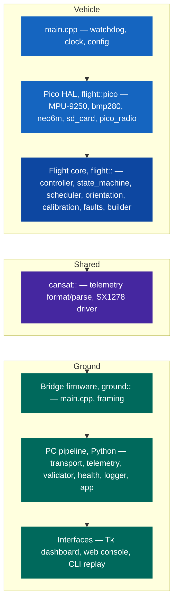
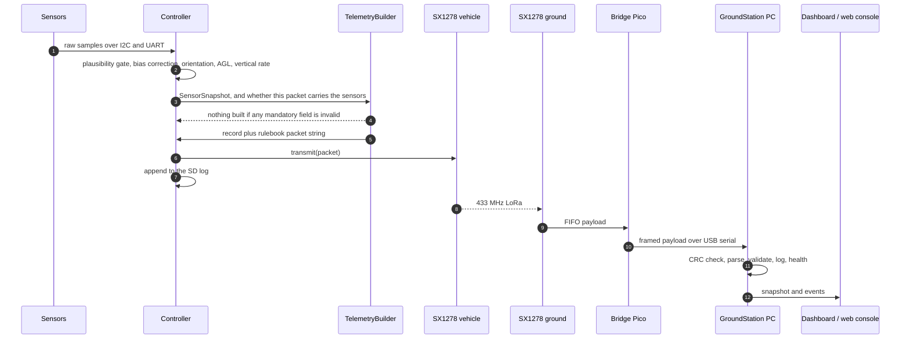
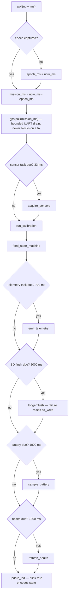
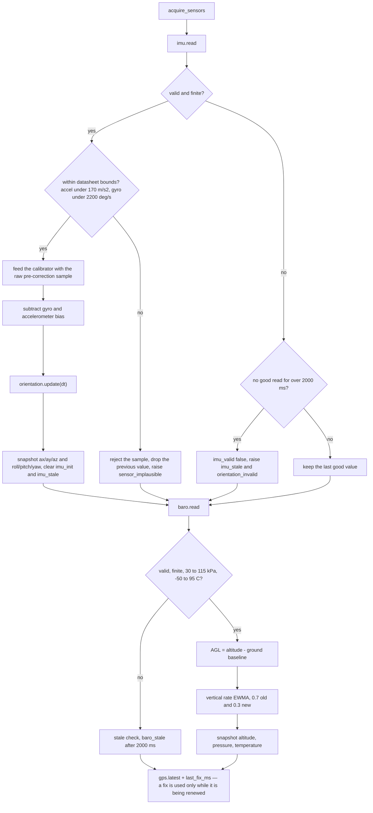
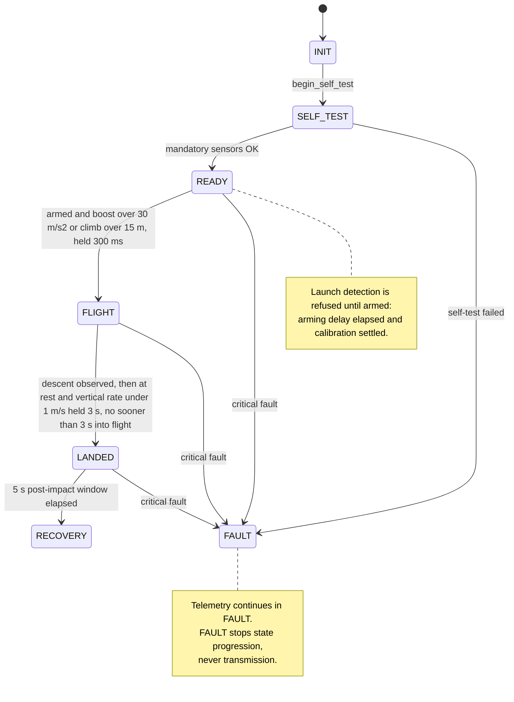
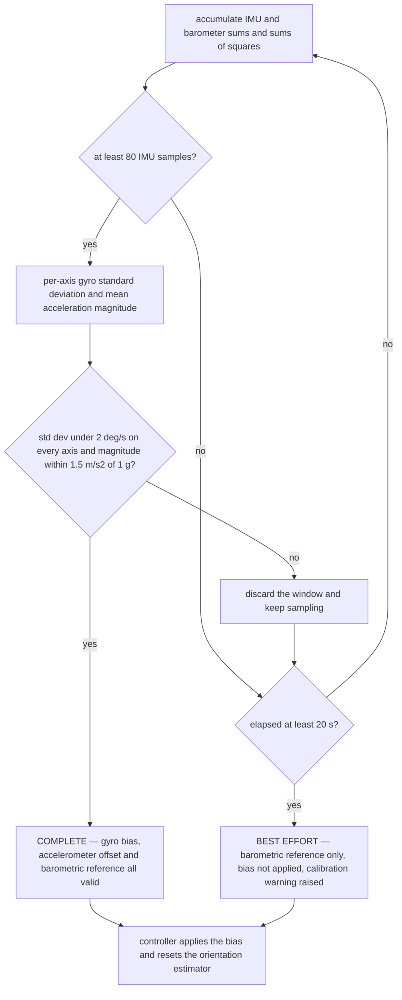
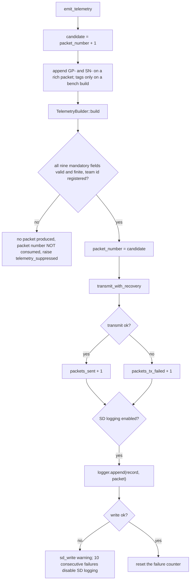
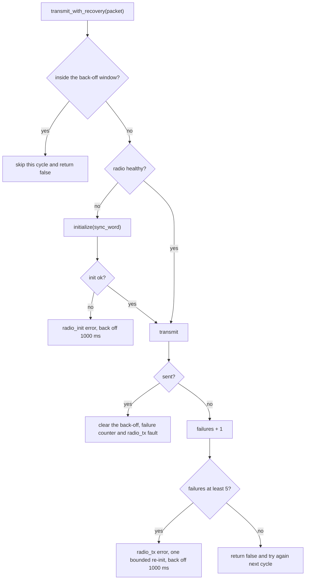
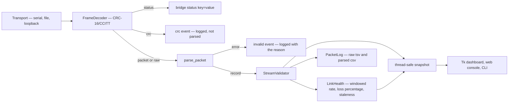

# Software Architecture

Complete map of the CanSat 2026 software: what each module does, how the layers depend on
one another, and the exact control flow inside the flight loop and the ground pipeline.

Everything described here exists in the repository and is exercised by the host test
suites, and the vehicle has since flown: two descents on 30 September 2026 (update 2026-10-02).
See [Verification status](#verification-status) for what the flights did and did not exercise.

---

## Contents

- [Layer model](#layer-model)
- [Repository to module map](#repository-to-module-map)
- [End-to-end data path](#end-to-end-data-path)
- [Flight computer](#flight-computer)
  - [Flight loop control flow](#flight-loop-control-flow)
  - [Sensor acquisition](#sensor-acquisition)
  - [Mission state machine](#mission-state-machine)
  - [Startup calibration](#startup-calibration)
  - [Telemetry generation](#telemetry-generation)
  - [Radio transmit with recovery](#radio-transmit-with-recovery)
  - [Fault model](#fault-model)
  - [Onboard logging](#onboard-logging)
- [Ground station](#ground-station)
  - [Bridge firmware](#bridge-firmware)
  - [Serial framing](#serial-framing)
  - [PC pipeline](#pc-pipeline)
  - [Web console](#web-console)
- [Timing budget](#timing-budget)
- [Design rules](#design-rules)
- [Verification status](#verification-status)

---

## Layer model

Each layer only depends on the layer beneath it. The flight core never includes a Pico SDK
header, which is why the whole mission logic is testable on a laptop.



**The dependency rule.** `flight_core` compiles against the host toolchain with no SDK
present. Hardware arrives only through the six abstract interfaces in
[`interfaces.hpp`](../../firmware/flight-computer/include/flight/interfaces.hpp):
`Imu`, `Barometer`, `Gps`, `Radio`, `SdLogger`, `BoardIo`. Tests substitute mocks
([`mock_hardware.hpp`](../../firmware/flight-computer/tests/mock_hardware.hpp)); the
vehicle substitutes `flight::pico::*`.

---

## Repository to module map

### Shared library — `firmware/common/`

| File | Responsibility |
|---|---|
| [`cansat/telemetry.hpp`](../../firmware/common/include/cansat/telemetry.hpp) | Canonical `TelemetryRecord`, `TelemetryValidity`, `GpsData`, `ParseResult` |
| [`src/telemetry.cpp`](../../firmware/common/src/telemetry.cpp) | Rulebook packet formatter, strict parser, team-id validation. No `<regex>` dependency |
| [`cansat/sx1278.hpp`](../../firmware/common/include/cansat/sx1278.hpp) | SX1278 / RA-02 LoRa driver contract and settings |
| [`src/sx1278.cpp`](../../firmware/common/src/sx1278.cpp) | Register-level driver, driven through a `Sx1278Hal` callback struct so it runs on the vehicle, on the bridge, or against a fake register bank |

### Flight core — `firmware/flight-computer/`

| Module | Responsibility |
|---|---|
| [`config.hpp`](../../firmware/flight-computer/include/flight/config.hpp) / [`config.cpp`](../../firmware/flight-computer/src/config.cpp) | Every tunable in one struct, `BoardPins`, and `validate_config()` |
| [`interfaces.hpp`](../../firmware/flight-computer/include/flight/interfaces.hpp) | The six hardware interfaces and their sample structs |
| [`controller.cpp`](../../firmware/flight-computer/src/controller.cpp) | The flight loop orchestrator — the single place mission behaviour is composed |
| [`state_machine.cpp`](../../firmware/flight-computer/src/state_machine.cpp) | `INIT` to `SELF_TEST` to `READY` to `FLIGHT` to `LANDED` to `RECOVERY`, plus `FAULT` |
| [`scheduler.cpp`](../../firmware/flight-computer/src/scheduler.cpp) | `PeriodicTask` — fixed-period, non-allocating, stall-tolerant timers |
| [`orientation.cpp`](../../firmware/flight-computer/src/orientation.cpp) | Nine-axis attitude: a Mahony complementary filter on the unit quaternion. The gyroscope propagates, the accelerometer corrects roll and pitch (and is ignored whenever the specific force is not near 1 g), the magnetometer corrects yaw and only yaw. Quaternion state rather than Euler integration, because a tumbling CanSat passes through the ±90° pitch singularity that breaks the Euler form |
| [`sensor_math.cpp`](../../firmware/flight-computer/src/sensor_math.cpp) | MPU-9250 accelerometer/gyroscope/temperature scaling, AK8963 magnetometer sensitivity and hard/soft-iron correction, Bosch BMP280 compensation, barometric altitude |
| [`startup_calibration.cpp`](../../firmware/flight-computer/src/startup_calibration.cpp) | Pad calibration: gyro bias, a rotation-invariant accelerometer scale, barometric ground reference. `MagCalibrator` estimates hard and soft iron from a rotation sweep and refuses to certify itself until every axis has actually been swept |
| [`telemetry_builder.cpp`](../../firmware/flight-computer/src/telemetry_builder.cpp) | Snapshot to record to packet string to SD CSV row |
| [`fault_manager.cpp`](../../firmware/flight-computer/src/fault_manager.cpp) | Fixed-size fault store indexed by enum; never grows |
| [`raw_block_log.cpp`](../../firmware/flight-computer/src/raw_block_log.cpp) | Append-only 512-byte-block log — no filesystem, no FAT dependency |
| [`gps_parser.cpp`](../../firmware/flight-computer/src/gps_parser.cpp) | Streaming NMEA-0183 (GGA and RMC) with checksum validation |
| [`health.cpp`](../../firmware/flight-computer/src/health.cpp) | `HealthSnapshot` and mission-state names |
| `src/pico/*` | Pico-only HAL, compiled only when the SDK is present |

> [!NOTE]
> **The nine-axis path described above is code this vehicle cannot exercise.** The delivered
> IMU is an MPU-6500 — six axes, no magnetometer
> ([F-1](../hardware/receiving-inspection.md#findings)). `orientation.cpp` degrades to a
> gyroscope-propagated yaw corrected in roll and pitch by gravity, and telemetry declares
> `YR-G`; the magnetometer branches in `orientation.cpp`, `sensor_math.cpp` and
> `startup_calibration.cpp` are implemented, tested against simulated fields, and dormant.
> `test_a_missing_magnetometer_degrades_rather_than_stops` is the test that says the
> vehicle keeps flying without one.

### Ground station

| Component | Path | Responsibility |
|---|---|---|
| Bridge firmware | [`firmware/ground-station/src/pico/main.cpp`](../../firmware/ground-station/src/pico/main.cpp) | RA-02 continuous RX to framed USB serial |
| Framing (C++) | [`framing.cpp`](../../firmware/ground-station/src/framing.cpp) | `$len,crc,payload` encoder and incremental decoder |
| Framing (Python) | [`transport.py`](../../ground-station/software/src/transport.py) | Byte-for-byte mirror, plus serial / file / loopback transports |
| Parser | [`telemetry.py`](../../ground-station/software/src/telemetry.py) | Packet to `TelemetryRecord`, precision-strict |
| Validator | [`validator.py`](../../ground-station/software/src/validator.py) | Team identity, sequence, duplicates, timestamp monotonicity, GPS sanity |
| Link health | [`health.py`](../../ground-station/software/src/health.py) | Sliding-window rate, loss percentage, CRC errors, staleness |
| Logger | [`logger.py`](../../ground-station/software/src/logger.py) | Raw `.tsv` (nothing discarded) and parsed `.csv` |
| Orchestrator | [`app.py`](../../ground-station/software/src/app.py) | Background thread, thread-safe snapshot, event queue |
| Dashboard | [`dashboard.py`](../../ground-station/software/src/dashboard.py) | Tk UI, non-blocking event drain |
| CLI | [`main.py`](../../ground-station/software/src/main.py) | `replay` and `live` subcommands |
| Web console | [`ground-station/web/index.html`](../../ground-station/web/index.html) | Zero-dependency browser console: demo, file replay, Web Serial |

---

## End-to-end data path



A packet only becomes a telemetry point if it survives every stage. Each stage's rejection
is counted separately, so a transport fault is never mistaken for a sensor fault.

---

## Flight computer

### Flight loop control flow

`Controller::poll(now_ms)` is called continuously from `main()` on a 2 ms tick. It is
non-blocking and bounded: no branch waits on hardware.



The ordering is deliberate. GPS is drained first so a full UART buffer can never back up;
calibration and the state machine run before telemetry so every packet carries the state
that matches the samples inside it.

### Sensor acquisition



Two rules matter here.

1. **An implausible reading is worse than no reading.** A value outside datasheet-derived
   bounds is not merely skipped — the previously held value is dropped too, so the vehicle
   never coasts on stale data from a sensor that is actively wrong.
2. **Staleness is time-based, not attempt-based.** A single failed read changes nothing;
   `sensor_stale_after_ms` (2 s) without a good read raises the fault.

### Mission state machine



**Critical fault is deliberately narrow.** Only a total loss of mandatory sensing counts:
invalid configuration, a failed self-test, or *both* IMU and barometer stale at the same
time. Anything the vehicle can still partly do keeps the mission running.

**Post-impact requirement.** The rulebook demands at least 5 s of telemetry after impact.
`LANDED` holds for `post_impact_transmission_ms` (5000 ms, and `validate_config()` refuses
to start below 5000) before `RECOVERY`, and telemetry never stops in either state.

**Why landing detection cannot use the accelerometer alone.** A vehicle descending under a
parachute at a steady rate has *no net acceleration*: the accelerometer reads about 1 g,
exactly as it does sitting on the ground. `||a| − g| < 2.5 m/s²` is therefore satisfied
throughout a normal descent, and on its own it would declare a landing seconds after the
parachute opened.

**The vertical rate is the only discriminator**, which is why so much care goes into it:

- a real descent runs at several metres per second, far above the 1 m/s threshold;
- the estimate is only updated when the barometer has genuinely produced a new reading, so
  over-sampling cannot push it toward zero mid-descent;
- but that hold is **bounded**, because an estimate frozen at a descent rate would prevent
  the landing from ever being detected. See
  [sensor-rates.md](sensor-rates.md#why-over-sampling-a-sensor-corrupts-vertical-speed).

**And being at rest is necessary but not sufficient, because a hover is also at rest.** A
vehicle hanging under a hovering drone reads 1 g with no vertical motion — which is the
at-rest test, exactly. Held for `landing_confirm_ms` that was a landing, and on a drone
profile it fired **twelve seconds before release**: `min_flight_ms` is aimed at a
boost-then-coast rocket where the vehicle is genuinely moving, but on a lift `FLIGHT` is
entered at `launch_altitude_gain_m` *during the ascent*, so its three seconds are gone before
the hover begins ([F-20](../testing/bring-up-record.md#findings)).

**The descent gate closes it.** A vehicle cannot land without descending first, so
`StateMachine` latches once the vertical rate has been below `-landing_descent_rate_mps`
(2 m/s) for `landing_descent_confirm_ms` (1 s), and refuses `FLIGHT → LANDED` until it
has. The at-rest timer does not start without it, so a hover cannot accumulate towards a
landing and then fire when the gate opens; the latch clears on any state change, so a descent
seen earlier cannot authorise a landing later; and `validate_config()` refuses a descent
threshold at or below the at-rest threshold, since one sample could then mean both. The gate
is physical rather than threshold-tuned, which is the point — no hover, however long or
however gentle the lift, can satisfy it.

> **Update 2026-10-02 — what the flights showed.** The competition launch was not a drone
> flight: the vehicle was carried up a building and thrown by hand from a terrace at about
> 29.5 m. The logic above still applies. Carrying it up met the 15 m climb condition, and
> standing still at the terrace edge for at least 4.3 s is the same condition as hovering
> under a drone, which is the case the descent gate exists for. In Flight 1 the status field
> read `ST-F111` (FLIGHT, armed, calibrated, 1 fault) for the whole record, through the stand-still,
> the throw and the descent; the record ends 1.3 m above the landing surface, so the landing
> transition itself was not exercised. The steady descent rates were 2.27 m/s (Flight 1) and
> 1.88 m/s (Flight 2), against the 2 m/s gate threshold — a margin this document did not
> anticipate when it sized the gate for a faster descent; see
> [final report](../project/CanSat-2026-Final-Project-Report.pdf) chapter 14.

Both failure directions are survivable and neither breaks rulebook compliance — telemetry
continues in every state — but they are wrong in different ways. A missed landing leaves
the mission reporting `FLIGHT` on the ground; a false landing starts the post-impact window
in mid-air. The 3 s confirmation window guards against a momentary reading of either kind.

### Startup calibration

Runs while the vehicle sits on the pad, during `INIT`, `SELF_TEST` and `READY`.



The asymmetry is intentional. A bias measured while the vehicle was moving would be worse
than no correction, so it is discarded — but the **barometric ground reference stays
usable** even then, because averaging pressure does not require stillness. Calibration
never blocks the mission.

### Telemetry generation



**Packet numbering is strictly sequential over transmitted packets.** A suppressed packet
does not consume a number, so the ground station sees `P-001`, `P-002`, `P-003` with no
gaps that would be indistinguishable from radio loss.

The wire format is defined in [telemetry-protocol.md](telemetry-protocol.md). The
formatter is the only place it is produced, and `parse_packet()` is the only place it is
consumed on the C++ side.

### Radio transmit with recovery



Recovery is bounded on purpose: a dead radio costs one initialisation attempt per back-off
window, never a blocking retry loop inside the flight loop.

### Fault model

Sixteen enumerated codes in a fixed-size array — no allocation, and constant cost
regardless of mission length. Faults carry severity, occurrence count, and first and last
timestamps. `clear()` marks recovery but keeps the history.

**Severity is monotonic while a fault is active.** The controller escalates some faults —
`imu_init` is reported as an *error*, then as *critical* once it is clear no compliant
packet can ever be produced — so `report()` honours an escalation but refuses a downgrade
until the fault is cleared. Without that rule a later routine report at the lower severity
would silently demote a fault that still applied, and `has_critical()` would stop seeing it.
`total_occurrences()` saturates rather than wrapping, because a count that reads as a small
number after wrapping is worse than one that stops at the maximum.

| Code | Severity | Raised when | Effect |
|---|---|---|---|
| `config_invalid` | critical | `validate_config()` fails | FAULT; no compliant telemetry is possible. The rule that refused is kept and printed at startup over USB as `CONFIG REFUSED: <reason>`, and is available from `Controller::config_error()` |
| `imu_init` / `baro_init` | error, critical if both | Sensor initialisation fails | Degraded; both dead means FAULT |
| `imu_stale` / `baro_stale` | error | No good read for 2 s | Affected fields invalid; both stale is critical |
| `orientation_invalid` | error | The estimator has no valid attitude | Roll, pitch and yaw invalid, so the packet is suppressed |
| `sensor_implausible` | warning | A reading falls outside datasheet bounds | The sample and the previous value are both dropped |
| `gps_unavailable` | warning | The GPS fails to initialise, has no fix, or has stopped refreshing its fix for longer than `gps_fix_timeout_ms` (default 3000 ms) | Optional GPS fields are omitted rather than repeating a position the receiver is no longer confirming; mission unaffected |
| `sd_unavailable` / `sd_write` | warning | SD init fails, or a write fails | Logging disables itself after 10 consecutive failures |
| `radio_init` / `radio_tx` | error | Init fails, or 5 consecutive transmit failures | Bounded re-init plus back-off |
| `battery_low` | warning | Below `battery_low_voltage`, only when a divider ratio is configured | Reported; no mission change |
| `telemetry_suppressed` | error | Mandatory data invalid at build time | The packet number is not consumed |
| `mag_unavailable` | warning | No magnetometer answered at initialisation, or a magnetometer that was answering stopped for longer than `sensor_stale_after_ms` | Yaw falls back to gyroscope integration and telemetry declares `YR-G`. **Standing on this vehicle**, whose IMU has no magnetometer ([F-1](../hardware/receiving-inspection.md#findings)) |
| `yaw_reference_disagreement` | warning | Magnetic heading and GPS course over ground disagree beyond `yaw_cog_max_error_deg` while moving faster than `yaw_cog_min_speed_mps` | Reported only. Unreachable on a six-axis part, which never claims a magnetic heading to disagree with |
| `calibration` | warning | Pad calibration did not settle cleanly | Best-effort reference used |
| `watchdog_reboot` | warning | The power session began with a watchdog reset | Recorded so the ground station can see the recovery |
| `sound_unavailable` | warning | The analogue microphone is absent, failed to start, or has stopped producing windows | Nothing. It is an additional sensor: the log loses two columns and every mandatory field is unaffected. It can never move the mission state, and `initialize()` returning false for it does not fail the self-test |
| `packet_oversize` | warning / error | A packet would exceed the airtime budget or the 255-byte LoRa FIFO | Optional fields are shed in rulebook priority order — diagnostics, then GPS. If the mandatory block alone still overflows the packet is suppressed (error) rather than truncated by the radio |

### Onboard logging

`RawBlockLog` writes newline-terminated records into a linear array of 512-byte blocks
with **no filesystem at all**, so the flight code carries no FAT dependency.

```text
base_lba + 0        header copy A  ─┐ magic 'CSAT', version, block size, next free
base_lba + 1        header copy B  ─┘ block, boot count, region size, sequence, checksum
base_lba + 2 .. N   one space-padded, newline-terminated record per block
```

A header is rewritten after every record, so a brownout or impact reset resumes at the
correct block instead of overwriting flight data, and the boot count increments on each
power session. A full region stops writing rather than wrapping over earlier data.

**The two header copies alternate**, each carrying a sequence number and a checksum. That
matters because the header is written after *every* record: power can fail during one, and
with a single header there would then be no valid resume point at all — so the next boot
would restart at the first record block and overwrite the entire flight it had just
recorded. With two copies, only the one being written can be damaged; the other still
holds the previous complete resume point. `test_raw_block_log_survives_a_torn_header_write`
destroys each copy in turn and checks the log resumes with its records intact.

---

## Ground station

### Bridge firmware

The ground Pico is a pure bridge: the SX1278 sits in continuous RX and every received
payload is framed straight to USB serial. It adds a
`#state=RX radio=... frames=... dropped=... rssi=... snr=... sync=0x..` status line once a
second, re-initialises the radio after 20 consecutive unhealthy polls, and runs a 3 s
watchdog so a hung bridge reboots and the PC transport reconnects on its own.

The `sync=` field is the sync word the bridge actually configured, read back out of the
same `link_profile.hpp` constant it programmed. The rulebook fixes one word for testing
(`0xF3`) and another for the launch (`0xA5`), and switching between them is a reflash of
both ends — so neither display is allowed to state which one is in use from a constant of
its own. Both the Tk dashboard and the web console show what the bridge reports, and show
`—` until it has reported anything. The same field rides the `#bridge=online` line, so the
answer is on screen from the first line the bridge emits.

### Serial framing

```text
'$' <len> ',' <crc16-hex4> ',' <payload bytes> '\n'
```

`len` is the decimal payload length. `crc16` is CRC-16/CCITT-FALSE (polynomial `0x1021`,
initial value `0xFFFF`) over the raw payload, lower-case, four hex digits. A payload
starting with `#` is a bridge status line.

The point of the CRC is separation of concerns: it tells the PC whether the **transport**
corrupted the bytes, independently of whether the **packet** was malformed. Three
implementations exist and must stay identical —
[`framing.cpp`](../../firmware/ground-station/src/framing.cpp),
[`transport.py`](../../ground-station/software/src/transport.py), and the decoder inside
[`index.html`](../../ground-station/web/index.html). A shared known-answer vector is
asserted in both test suites.

### PC pipeline



`GroundStation` runs the whole pipeline on a background thread and talks to the UI through
a bounded event queue plus a lock-protected snapshot. When the queue fills, the oldest
event is dropped rather than blocking the receive thread, so a slow UI can never stall
reception or logging.

**Nothing received is ever discarded.** Malformed packets, CRC failures and rejected
packets all reach the raw `.tsv` with their receipt timestamp and the reason.

### Web console

[`ground-station/web/index.html`](../../ground-station/web/index.html) is a single file
with no build step and no dependencies. It ports the parser, the validator, the
link-health model and the CRC framing from the Python and C++ sources, so it accepts
exactly what the bridge emits. Three sources are available: a generated demo mission, a
packet file, or a live Web Serial connection to the bridge Pico.

---

## Timing budget

| Activity | Period | Configured by | Note |
|---|---:|---|---|
| Main tick | 2 ms | `loop_tick_ms` | The loop is non-blocking; the delay only yields. Bounded above twice over: it sets scheduling jitter (under 6 % of the 33 ms acquisition period) **and** it must drain the GPS UART before its 32-byte FIFO fills, which at 9600 baud takes 33 ms. `validate_config()` enforces both |
| Sensor acquisition and orientation | 33 ms | `sensor_period_ms` | 30 Hz attitude and altitude-rate update; bounded by the barometer, see [sensor-rates.md](sensor-rates.md) |
| Telemetry packet | 700 ms | `telemetry_period_ms` | **1.43 Hz — the fastest the SF7/125 kHz modem sustains inside the 50 % duty cap.** Sized from the *measured* airtime, not the model: the model under-reads by 1.8 %. Every packet carries GPS and sound and no diagnostic tags — held to the 200 bytes the organizers' receiver accepts — because the organizers count only transmitted telemetry for extra-sensor points. After the max-rate command the vehicle leaves this period for a rich, lean, lean pattern of 374 and 296 ms slots ([max-rate-command.md](max-rate-command.md)). **1000 ms remains the enforced ceiling** for the rulebook minimum, and 700 keeps 300 ms of margin against jitter crossing it. See [link-budget.md](link-budget.md) |
| SD flush | 2000 ms | `sd_flush_period_ms` | Appends happen per packet; this is the sync |
| Battery sample | 1000 ms | `battery_period_ms` | |
| Health refresh | 1000 ms | `health_period_ms` | |
| Flight watchdog | 2000 ms | `main.cpp` | A hung loop reboots and telemetry restarts |
| Bridge watchdog | 3000 ms | bridge `main.cpp` | A hung bridge reboots and the PC reconnects |
| Bridge status line | 1000 ms | bridge `main.cpp` | |

`PeriodicTask` self-corrects after a stall: if the loop falls behind by more than one
period, the next due time re-anchors to `now + period` instead of firing a catch-up burst.

---

## Design rules

These are the invariants the code is built around. Breaking one is a design change, not a
refactor.

1. **Telemetry never stops.** No peripheral failure, and no state including `FAULT`,
   suppresses telemetry that can still be produced correctly.
2. **Wrong data is worse than no data.** Mandatory fields that cannot be trusted suppress
   the packet instead of transmitting a plausible-looking wrong value.
3. **Sequential numbering is over transmitted packets.** Suppression does not consume a
   number.
4. **The flight core knows no hardware.** Anything device-specific lives behind an
   interface, under `src/pico/`.
5. **Nothing in the flight loop blocks or allocates.** Fixed-size buffers, bounded
   recovery, no dynamic containers on the hot path.
6. **Provisional values are labelled.** Everything the rulebook or the hardware has not
   fixed is marked `PROVISIONAL` in `config.hpp`. Only the sync words `0xF3` (test) and
   `0xA5` (official) are fixed by the rulebook.
7. **The placeholder team id is rejected on purpose.** `CAN-Team-XX` fails
   `validate_config()`, so the vehicle cannot fly with an unset identity.

---

## Verification status

| Scope | Status |
|---|---|
| Flight core logic, telemetry format, parser, framing, GPS parsing, fix ageing and validation, state machine, attitude fusion, calibration, radio airtime, sensor timing, packet-size degradation, log recovery | **Verified on host** — 143 C++ suites with 4674 assertions, plus the LoRa driver (168) and the microSD driver (613) against simulated devices, 269 Python tests including an end-to-end trace, and 71 Node tests |
| Pico HAL sources | **Compile-checked only** on the host — `-fsyntax-only` against minimal SDK stubs; the real image ran on the vehicle (next rows) |
| Pico firmware image | **Built and flown.** The host build needs `PICO_SDK_PATH` and `pico_sdk_import.cmake`; the image that flew on 2026-09-30 is the one these documents describe |
| Sensors, radio link, SD card, power, antenna | **Verified on the soldered vehicle board, 2026-09-07.** Gates 3, 4, 5, 6 and 7 all pass: both I2C sensors on one bus, clean NMEA, airtime within 1.8 % of the model over 55 transmits, the card writing and sustaining ~300 writes/s, and the shared SPI0 bus clean across 200 interleaved rounds. See the [bring-up record](../testing/bring-up-record.md). Not verified at that date: the sound module, the battery divider, the switch and the antenna's range performance — the flights below settle the last |
| **Flown, 2026-09-30** | **Verified in flight, update 2026-10-02.** Two descents recorded by the organizers' station ([`analysis/flight-2026-09-30/`](../../analysis/flight-2026-09-30/); final report chapter 14): 102 distinct packets received, RSSI −109…−79 dBm (link margin ≥ 14 dB), packets ≤ 188 B, the max-rate cadence at 3.09 Hz with gaps 0.374 / 0.296 / 0.297 s, sound present (the throw is the loudest packet of Flight 1, 36.3 mV p-p), GPS fixes in every rich packet. **The 2 s watchdog was observed to act:** after Flight 1 the vehicle restarted itself about 2 s after the end of the record, skipped the command window, resumed telemetry at packet 1 already in the max-rate pattern, calibrated in 5.5 s (`ST-R004` to `ST-R113`), re-armed, and was heard for 12.95 s (41 packets), against the rulebook's 5 s post-impact requirement. At rest afterwards: 1.000 g, altitude 0.0 ± 0.1 m after calibration. Not exercised: the landing transition (the log ends 1.3 m above the surface in Flight 1) and the egg payload, for which no result is claimed |

Host tests prove logic; the flights of 30 September 2026 are the hardware evidence. See
[test-plan.md](../testing/test-plan.md) for what is covered and what is still open.
