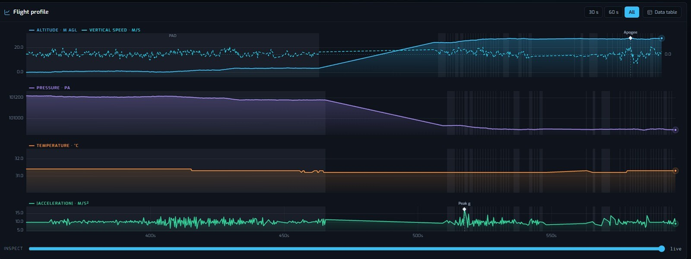
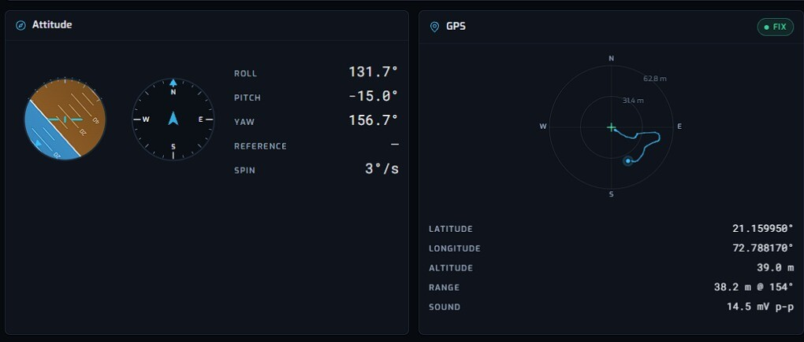
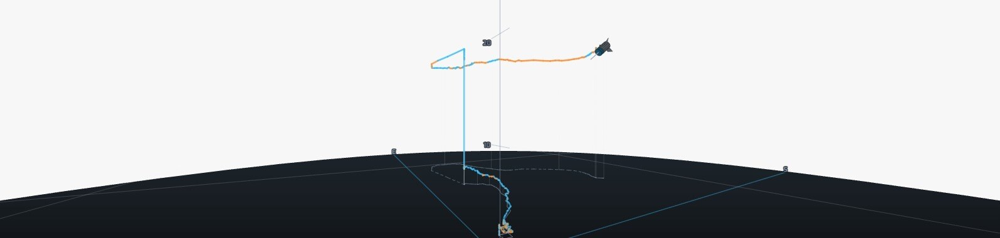

# Web Telemetry Console

`index.html` is a self-contained (single file, no build, no dependencies) browser console
for CanSat-2026 telemetry. Open it directly, or serve the folder.

## Sources

| Source | Use |
|---|---|
| **Demo** | replays a generated drone-lift mission (the demo; the real launch was a hand throw from a terrace) (READY → FLIGHT → LANDED → RECOVERY) at 2 Hz (the demo generator paces itself; the flight radio runs at 1.43 Hz, see [link-budget.md](../../documentation/design/link-budget.md)); auto-starts, and deliberately injects one dropped packet and one duplicate so link health is exercised |
| **File…** | replays a packet file — plain newline packets, a `raw_packets.tsv` from the Python logger, or a framed `.bin` |
| **Web Serial** | connects to the ground-station bridge Pico over USB (Chrome/Edge, HTTPS or `localhost`), decoding the `$len,crc,payload` framing live |

## What it shows

- **Stat tiles** — altitude (m AGL), vertical speed, pressure, temperature and
  acceleration magnitude, each with a sparkline and a 5-second delta
- **Mission** — state, mission clock, state ladder, team, packet number, calibration,
  armed status, active faults, sync word
- **Link health** — rate, packets OK, missing, duplicates, CRC errors, loss percentage,
  time since last packet, a rate sparkline, vehicle restarts, and the bridge radio's own
  **RSSI**, **SNR** and
  dropped-frame count. RSSI is what warns you a link is running out of headroom while
  packet loss is still zero
- **Flight view · 3D** — orbit / chase / top / profile views of the trajectory, with
  ascent and descent tracks and a filtered ground track
- **Flight profile** — altitude, vertical speed, pressure and temperature against time,
  with phase bands and apogee, touchdown and peak-g markers, plus a data table view
- **Attitude** — roll, pitch and a yaw heading card with spin rate
- **GPS** — fix status, position, satellites
- **Raw packet monitor** — every line received, accepted or rejected, with the reason

**Copy CSV** puts the accepted samples on the clipboard. **Pause** freezes the display
while packets keep arriving and buffering. The theme toggle switches light and dark.

## At the competition

*Update 2026-10-02.* The console was used at the competition launch of 30 September 2026
alongside the organizers' receiver. Three screenshots, copied here from the final report's
figures:

| Screenshot | View |
|---|---|
| [`gs-flight-profile.jpg`](gs-flight-profile.jpg) | Flight profile: altitude, vertical speed, pressure, temperature |
| [`gs-attitude-gps.jpg`](gs-attitude-gps.jpg) | Attitude and GPS panels |
| [`gs-track-3d.jpg`](gs-track-3d.jpg) | The 3D trajectory view |





The flight record analysed in the repository is the organizers' export, not this console's
(see [`analysis/flight-2026-09-30/`](../../analysis/flight-2026-09-30/README.md)).

## Ports

The parser, `StreamValidator`, `LinkHealth` and the CRC-16/CCITT framing are ports of
`ground-station/software/src/{telemetry,validator,health}.py` and
`firmware/ground-station/src/framing.cpp`, so the console accepts exactly what the Pico
bridge emits.

The packet rate uses the same 5-second sliding window as `health.py` — deliberately not an
EWMA of instantaneous intervals, because a duplicate or a buffered burst arriving in the
same millisecond would otherwise report thousands of Hz and take about ten packets to
settle.

### Testing the ports

The logic is bracketed by `// PORTABLE-CORE:BEGIN` and `// PORTABLE-CORE:END` markers in
`index.html`. Everything between them is pure logic with no DOM or browser dependency, and
`tests/console_core.test.mjs` extracts it verbatim and runs it under Node:

```bash
node --test ground-station/web/tests/console_core.test.mjs
```

`tools/build_host.sh` runs it too, whenever Node is available, and CI fails if it is
skipped. The harness asserts the core never touches `document`, `window`, `matchMedia` or
`localStorage` — keep presentation code below the END marker so the logic stays testable.

Parser cases come from [`test-data/protocol-fixtures.tsv`](../../test-data/protocol-fixtures.tsv),
the same file the C++ and Python suites read, so a divergence between the three parsers
fails the build instead of appearing during a mission.

Rendering is still verified by hand in a browser: there is no headless browser in the
repository.

`index.legacy.html` is the previous single-panel console, kept for reference only.
