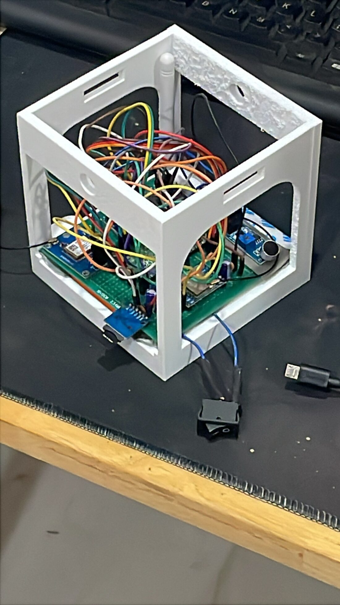
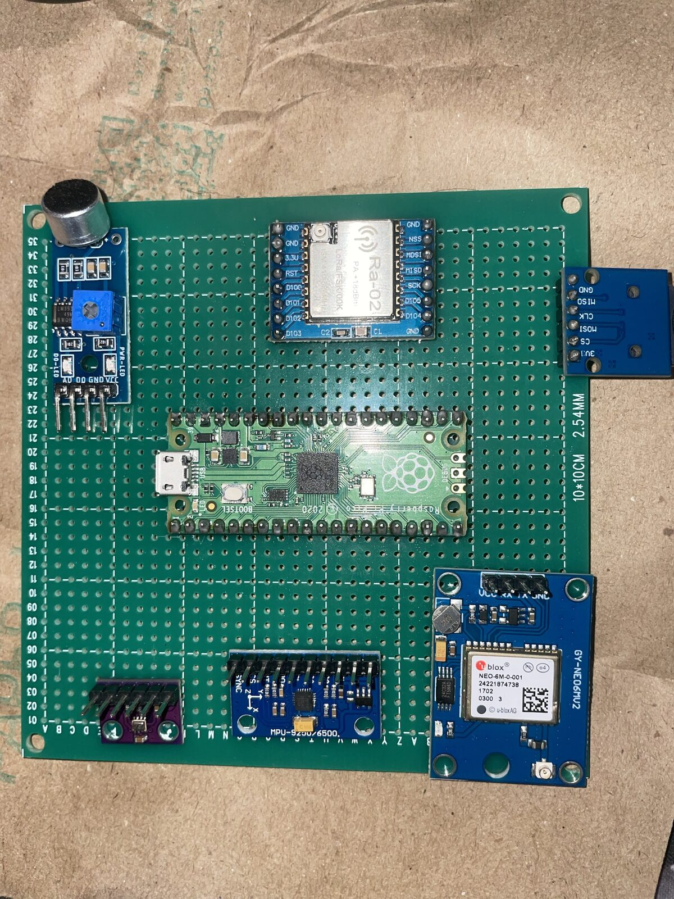

# Mechanical photos and renders

| File | What it is |
|---|---|
| [`cansat-d1-render-1.png`](cansat-d1-render-1.png) | `Cansat_D1` render, three-quarter view from above |
| [`cansat-d1-render-2.png`](cansat-d1-render-2.png) | `Cansat_D1` render, second view |
| [`cansat-assembled.jpg`](cansat-assembled.jpg) | **Photograph** of the assembled vehicle |
| [`pcb-top.jpg`](pcb-top.jpg) | **Photograph** of the vehicle board, component side |

> [!NOTE]
> **Update 2026-10-02 — photographs now exist.** The two JPEGs above are photographs of the
> built hardware (copied from the final report's figures,
> `documentation/project/report-2026/figures/photos/`). They replace the earlier note here
> that no photograph of the vehicle existed; that note is kept in the history of the file,
> not repeated.
>
> **Still not in the repository:** side and bottom views, the board's second face, the open egg
> chamber, and the team and mentor photographs listed in the shot list below.

**The two PNG files are renders of the CAD, not photographs of hardware.** A render shows
the design; it is not evidence about the article. Anything claimed about the built vehicle is
evidenced by the JPEGs.

### The shot list

The first two photographs above cover the three-quarter whole-vehicle row and one face of the board; the rest are still open.

| Shot | Why |
|---|---|
| Top, side, bottom | **Mandatory**, section F imaging |
| Three-quarter, whole vehicle | The one that carries section D's build-quality impression |
| Board in situ, lid off | Shows the wiring and the mounting, which is what "build quality" means here |
| PCB alone, both faces | **Mandatory**, section F |
| Egg chamber, open | PAY-002 is a requirement in its own right and it is built |
| Team with the CanSat, and with mentors | **Mandatory**, section F |

White PETG photographs cleanly against almost any background, which was part of the reason
for choosing it — see [material and manufacture](../README.md#material-and-manufacture).

---

## What the render shows

An open box frame, 118.5 × 115.0 × 110.0 mm, to be printed in **PETG**:

- **Two solid side panels** and two faces opened out with large arched cutouts — the
  material is where the load path is, which is what the [simulation](../simulation/README.md)
  studies were checking.
- **A central vertical spine** with a through-hole, dividing the volume.
- **Rectangular slots** top and bottom, in pairs — harness or strap routing.
- **Round holes** in the side panels and the spine.
- **A rectangular cutout with two small round holes beside it** on one upper face — the
  switch and the two indicator LEDs.

> **The rectangular cutout is the switch** — confirmed 2026-09-09 — and the two small round
> holes beside it are the LED positions. That accounts for three of the four penetrations the
> vehicle needs; **USB access for the Pico is the one left to confirm**, and there is
> [only 2.5 mm of clearance per side](../README.md#the-envelope-question--asked-and-answered)
> for anything that protrudes.

---

## Conventions

- **PNG for renders**, which have flat colour and hard edges. JPEG for photographs of real
  hardware, which do not — the same split the
  [hardware photos](../../documentation/hardware/photos/README.md) use.
- **Name the file after what it shows**, not after the export counter. `Cansat_CAD_Photo_1`
  tells the next reader nothing.
- **A render is not evidence.** It shows the design, not the article. Anything claimed about
  the built vehicle needs a photograph of the built vehicle.

Related: [mechanical/README.md](../README.md) · [CAD/](../CAD/README.md) ·
[simulation/](../simulation/README.md)
