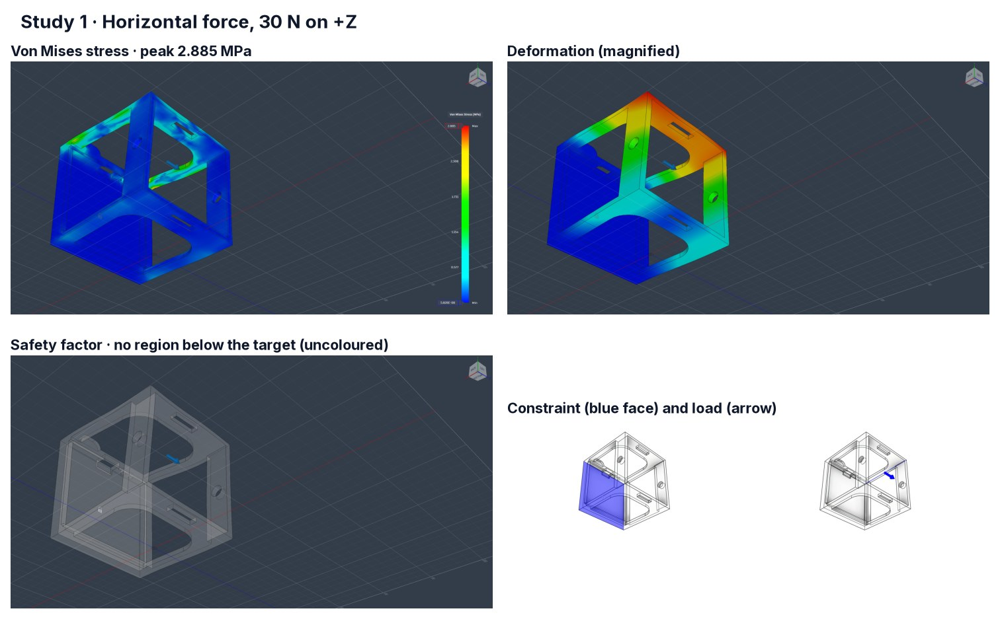
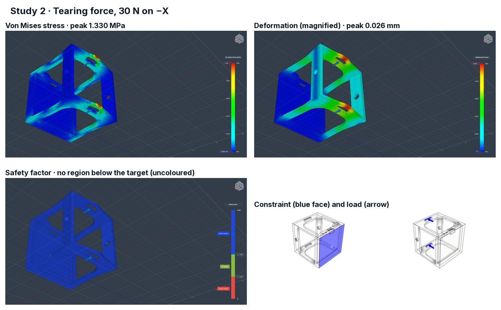
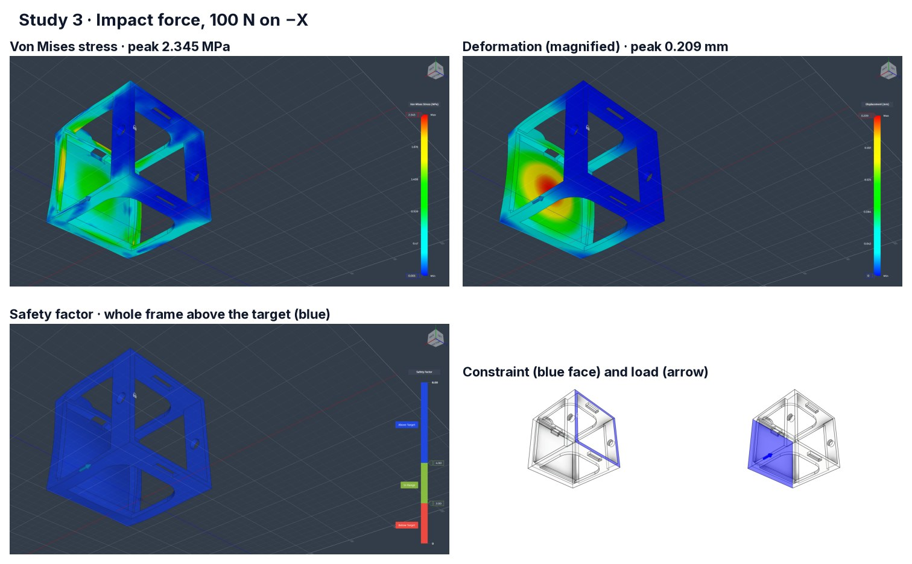

# Structural simulation

Three static-stress studies on `Cansat_D1`, run in Fusion 360 on 2026-09-09 by Kunj
Sorathiya.

| Report | Study | Load | Mesh | **Max von Mises** | **Min safety factor** |
|---|---|---|---|---:|---:|
| [study-1-horizontal-force.html](study-1-horizontal-force.html) | Horizontal force | **30 N** on +Z | 5838 nodes / 2619 elements | **2.885 MPa** | **15** |
| [study-2-tearing-force.html](study-2-tearing-force.html) | Tearing force | **30 N** on −X | 5838 nodes / 2619 elements | **1.330 MPa** | **15** |
| [study-3-impact-force.html](study-3-impact-force.html) | Impact force | **100 N** on −X | 7148 nodes / 3299 elements | **2.345 MPa** | **15** |

All three: static stress, one fixed constraint, parabolic elements, no adaptive refinement.
Safety factors read from Fusion 2026-09-09.

**The structure is not close to failing in any of the three cases.**

**Fusion 360 composites (2026-10-02).** The result plots are also shown, one composite image
per study, in the [final report](../../documentation/project/CanSat-2026-Final-Project-Report.pdf)
§8.4:

| Composite | Study |
|---|---|
| [`fusion-study-1.jpg`](fusion-study-1.jpg) | 1 · horizontal force — von Mises 2.885 MPa |
| [`fusion-study-2.jpg`](fusion-study-2.jpg) | 2 · tearing force — von Mises 1.330 MPa, displacement 0.026 mm |
| [`fusion-study-3.jpg`](fusion-study-3.jpg) | 3 · impact force — von Mises 2.345 MPa, displacement 0.209 mm |

Studies 1 and 2 show nothing below the safety-factor target (the plot is uncoloured); study 3
shows blue, above target.

---

## Four things to know before quoting these numbers

### 1 · The report says the design breaks. It does not — settled.

All three exports contain the sentence:

> *"With the analysis criteria in this study setup, the design is expected to bend
> permanently or break."*

**It is template text, and the minimum safety factors confirm it.** The sentence sits above a
block containing *both* the "Below Safety Factor Target" and "Above Safety Factor Limit"
advice lists — which is what a template emits when it renders every branch rather than the
one that applied. Fusion's *Result Summary* table **exported completely empty**, so the
numbers here were read off the plots and, for the safety factors, out of Fusion directly.

**And the reported 15 is a display cap, not a result.** All three studies report a minimum
safety factor of exactly 15, while their peak stresses differ by more than a factor of two:

| Study | Max von Mises | Yield ÷ stress |
|---|---:|---:|
| Horizontal | 2.885 MPa | **18.9** |
| Tearing | 1.330 MPa | **40.9** |
| Impact | 2.345 MPa | **23.2** |

Three different load cases cannot all have a true minimum of exactly 15. **Fusion's safety
factor legend caps at 15 by default**, so "15" means *at or above the cap, everywhere on the
part* — which is consistent with the yield-derived figures above and is the stronger
statement of the two.

**So: minimum safety factor ≥ 15 across the whole part, in all three load cases.** The
"expected to break" sentence can be disregarded.

### 2 · The simulation material is PET. The part was printed in PETG.

The studies assign Fusion's **"PET Plastic"**:

| Property | Value in the study | Typical bulk PETG |
|---|---:|---:|
| Density | **1.541 g/cm³** | ~1.27 g/cm³ |
| Young's modulus | 2757.9 MPa | ~2000–2100 MPa |
| Poisson's ratio | 0.417 | ~0.40 |
| Yield strength | 54.40 MPa | ~50 MPa |
| Ultimate tensile | 55.10 MPa | ~50 MPa |

PET is stiffer, denser and slightly stronger than PETG, so the studies are **mildly
optimistic on strength and materially wrong on mass** — the density is **21 % high**, which
matters directly to the mass budget.

**And the mass error turned out to be larger than the density alone.** The printed part
weighs **≈ 128.7 g** where the PET-density model implies 234.2 g and the ×0.82 density
correction implies 192.0 g. The remaining gap is infill: a solid-volume figure assumes no
infill saving at all, and a real slice of a thin-walled open frame is mostly perimeter and
air. **The studies model a solid part; the printed one is not solid**, which is a separate
optimism from the material choice and is not covered by the anisotropy derating below.

### 3 · A printed part is not a bulk part, and this is the bigger caveat

These are isotropic bulk-material studies. **An FDM part is not isotropic.** Inter-layer
adhesion in the Z direction is typically **40–70 % of the in-plane strength**, and printed
parts carry voids the model does not have. A load that pulls layers apart sees far less
material strength than the study assumes.

**Print orientation, decided 2026-09-09: as modelled — the part is printed in the
orientation the [renders](../photos/README.md) show it in**, sitting on its base. Layers
therefore stack vertically, and the weak directions are tension normal to the layers
(vertical) and interlayer shear.

**The margin absorbs the derating comfortably**, which is the whole point of having had it:

| Study | Yield ÷ stress | ×0.40 | ×0.55 | ×0.70 |
|---|---:|---:|---:|---:|
| Horizontal | 18.9 | **7.6** | 10.4 | 13.2 |
| Tearing | 40.9 | 16.4 | 22.5 | 28.6 |
| Impact | 23.2 | **9.3** | 12.8 | 16.2 |

**Even at the pessimistic 40 % and even taking the capped 15 rather than the yield-derived
figure, the effective safety factor is 6.** That is still a structure with margin, not one
being argued into compliance.

**One thing to confirm by eye:** study 1 loads **+Z** and produces the highest stress. If the
study's Z is the same vertical axis the part is printed along, that load is in the weak
direction and study 1 is the row the derating actually bites on. It is the row with the
smallest margin either way, so this changes the reasoning rather than the conclusion.

### 4 · The 100 N impact load is an assumption, and it is worth stating

The 100 N came from a **500 g vehicle at 5 m/s**, which is 2.5 N·s of momentum to absorb. The
force depends entirely on how long the arrest takes:

| Arrest time | Force at 500 g / 5 m/s |
|---:|---:|
| 25 ms | **100 N** ← what study 3 assumes |
| 10 ms | 250 N |
| 5 ms | 500 N |

**100 N therefore models a landing that takes 25 ms to stop** — a compliant arrival on grass
or soil, with the structure and the parachute doing some of the work. A rigid landing on
concrete is several times worse. Neither is wrong; the assumption just has to be written
down beside the result, which is what this section is for.

**The mass band brackets the assumption.** The vehicle was ballasted into 450–550 g before
submission (reported by the team, 2026-09-14), and under the model's 80 cm floor canopy (the flown canopy was 6 ft, so the real landings were far gentler — see below) its landing
momentum sits either side of the studied case:

| Case | Mass | Rate | Momentum | Force at 25 ms | at 10 ms |
|---|---:|---:|---:|---:|---:|
| Study 3's assumption | 500 g | 5.00 m/s | 2.50 N·s | **100 N** | 250 N |
| Bottom of the band, ISA | 450 g | 4.37 m/s | 1.97 N·s | 79 N | 197 N |
| Nominal, ISA | 500 g | 4.61 m/s | 2.31 N·s | 92 N | 231 N |
| Top of the band, 35 °C | 550 g | 5.00 m/s | 2.75 N·s | **110 N** | 275 N |
| *Unballasted, for comparison* | *315 g* | *3.66 m/s* | *1.15 N·s* | *46 N* | *115 N* |

**At the top of the band the landing is 10 % harder than study 3**, which scales the capped
safety factor of 15 to about 13.6 and the worst derated figure to about 8. The margin absorbs
it easily. *Until 2026-09-14 this section said the as-built mass made the study conservative;
that was true of the unballasted 315 g vehicle and stopped being true when the ballast went
in.*

**None of this retires the bigger caveat: all three studies load horizontally**, and a vehicle
under a canopy lands base-first, along the print's weak axis. A similar force in the wrong
direction is still the wrong direction.

**A drop test settles it**, and it is also what section C actually scores.

**Update 2026-10-02.** The vehicle was thrown twice at the competition and landed under a
6 ft canopy at 2.27 and 1.88 m/s. From the log, touchdown kinetic energy was about 0.8–1.4 J
(a fall of 18–26 cm) and a 25 ms stop implies about 34–50 N, against the 100 N used in study 3.
The structure survived; the vertical case was not studied by simulation.

---

## The reports

Fusion's own HTML exports, committed unmodified. They are ~4.5 MB each because every result
plot is embedded as a base64 image — that is also why they are worth keeping, since the
plots are where the numbers on this page came from.

Open them in a browser. They carry the full study setup: contact tolerance, mesh parameters,
element order, material properties, constraints and loads.

---

## What is still missing

| Item | Why it matters |
|---|---|
| ~~Minimum safety factor~~ | **Done 2026-09-09: ≥ 15 in all three**, at Fusion's display cap |
| ~~Print orientation~~ | **Done 2026-09-09: as modelled**, printed on its base |
| ~~The structure's mass~~ | **Measured 2026-09-12, and the estimate was 33 % high.** The printed part with its egg chamber is **≈ 128.7 g**, against the 193 g the solid-volume route predicted — see the [mass budget](../README.md#mass-budget). Stress and safety factor are unaffected: they scale with geometry and yield, not density. **The mass budget is affected, and in the safe direction** — the vehicle is well under the limit rather than near it |
| **A vertical impact case** | All three studies load horizontally. **A vehicle hanging under a parachute lands base-first**, so the impact that matters is along the build axis — which is also the print's weak direction. The one load case not yet run, and **the part is now printed**, so the answer arrives from a drop test rather than a re-run if nobody re-runs it |
| **Total displacement, per study** | The displacement legend is cropped out of the exported plot in study 1 |
| **A PETG material definition** | See above — the current one is 21 % too dense and somewhat too strong. It would lower every stress figure and raise every safety factor's honesty |
| **A dedicated drop test** | Two competition throws were made on 2026-09-30 (both survived, ≈ 34–50 N at a 25 ms stop), but no instrumented drop-test campaign is on record |

Related: [mechanical/README.md](../README.md) · [CAD/](../CAD/README.md) ·
[photos/](../photos/README.md)
